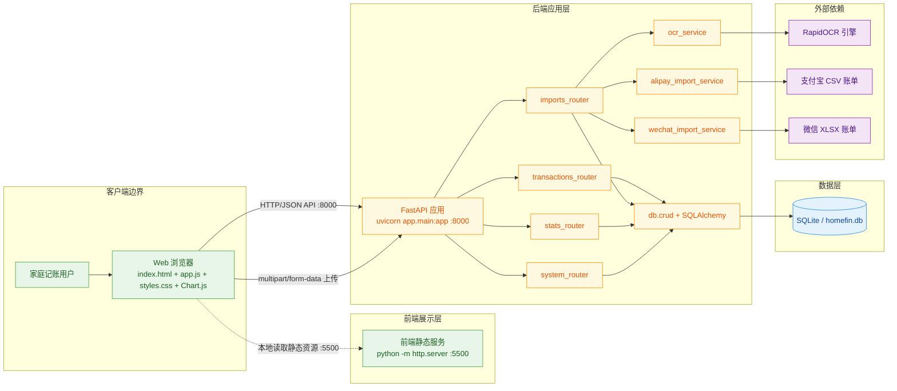

# 家庭财务小管家模块框架图（Mermaid）

基于系统整体结构、模块协作与数据流。

```mermaid
flowchart LR
    subgraph C[客户端边界]
        U[家庭记账用户]
        B[Web 浏览器<br/>index.html + app.js + styles.css + Chart.js]
        U --> B
    end

    subgraph F[前端展示层]
        FE[前端静态服务<br/>python -m http.server :5500]
    end

    subgraph A[后端应用层]
        API[FastAPI 应用<br/>uvicorn app.main:app :8000]
        TR[transactions_router]
        IR[imports_router]
        SR[stats_router]
        SYS[system_router]
        OCRS[ocr_service]
        AIS[alipay_import_service]
        WIS[wechat_import_service]
        CRUD[db.crud + SQLAlchemy]
    end

    subgraph D[数据层]
        DB[(SQLite / homefin.db)]
    end

    subgraph E[外部依赖]
        OCR[RapidOCR 引擎]
        ALI[支付宝 CSV 账单]
        WEC[微信 XLSX 账单]
    end

    B -. 本地读取静态资源 :5500 .-> FE
    B -- HTTP/JSON API :8000 --> API
    B -- multipart/form-data 上传 --> API

    API --> TR
    API --> IR
    API --> SR
    API --> SYS

    TR --> CRUD
    IR --> OCRS
    IR --> AIS
    IR --> WIS
    IR --> CRUD
    SR --> CRUD
    SYS --> CRUD

    OCRS --> OCR
    AIS --> ALI
    WIS --> WEC

    CRUD --> DB

    classDef client fill:#E8F5E9,stroke:#43A047,color:#1B5E20,stroke-width:1px;
    classDef app fill:#FFF8E1,stroke:#FB8C00,color:#E65100,stroke-width:1px;
    classDef data fill:#E3F2FD,stroke:#1E88E5,color:#0D47A1,stroke-width:1px;
    classDef ext fill:#F3E5F5,stroke:#8E24AA,color:#4A148C,stroke-width:1px;

    class U,B,FE client;
    class API,TR,IR,SR,SYS,OCRS,AIS,WIS,CRUD app;
    class DB data;
    class OCR,ALI,WEC ext;
```
