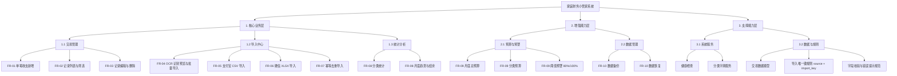

# 家庭财务小管家功能（模块）层次图

基于《需求规格说明书（V1.1）》中的 FR-01 ~ FR-10，项目功能模块可分为“核心业务层、增强能力层、支撑能力层”三层。

## 一、功能（模块）层次图

## 二、分层说明

1. 核心业务层：系统最小可用闭环，覆盖“录入-导入-统计”。
2. 增强能力层：在核心业务上提升可管理性和长期可用性（预算、备份恢复）。
3. 支撑能力层：为上层提供健康检查、分类字典、数据约束和校验规则。

## 三、模块与需求映射

1. 交易管理：FR-01、FR-02、FR-03。
2. 导入中心：FR-04、FR-05、FR-06、FR-07。
3. 统计分析：FR-08。
4. 预算与预警：FR-09。
5. 数据管理：FR-10。

## 四、参考《流程图绘制指南》的手工绘制步骤（draw.io）

1. 选择形状库：左侧选中 Flowchart。
2. 添加顶层节点：使用 Terminator 或 Process，输入“家庭财务小管家系统”。
3. 添加一级模块：新增 3 个 Process，分别为“核心业务层、增强能力层、支撑能力层”。
4. 添加二级模块：
	- 核心业务层下添加“交易管理、导入中心、统计分析”。
	- 增强能力层下添加“预算与预警、数据管理”。
	- 支撑能力层下添加“系统服务、数据与规则”。
5. 添加三级功能点：按上方 Mermaid 图中的 FR 编号逐个补齐。
6. 连线：使用带箭头连接线，自顶向下连接，保持“父模块 -> 子模块”。
7. 标注规范：节点名称建议格式为“模块名（FR 编号）”或“FR-XX 功能名”。
8. 布局优化：
	- 上中下三层排列，避免交叉线。
	- 同层节点横向对齐。
	- P0 模块可用深色，P1 模块可用浅色。
9. 导出：优先导出 PNG 或 PDF，命名建议“HomeFin_功能模块层次图_v1.1”。

## 五、检查点

1. 是否完整覆盖 FR-01 ~ FR-10。
2. 是否体现“核心业务层 > 增强能力层 > 支撑能力层”的分层逻辑。
3. 是否标明导入去重规则（source + import_key）。
4. 是否可以从图中直接定位每个需求所属模块。
