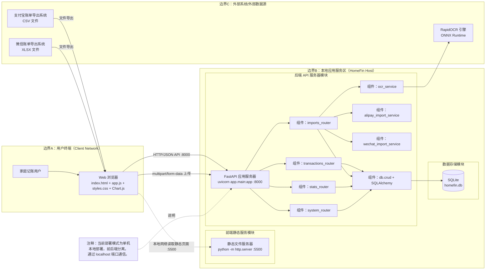
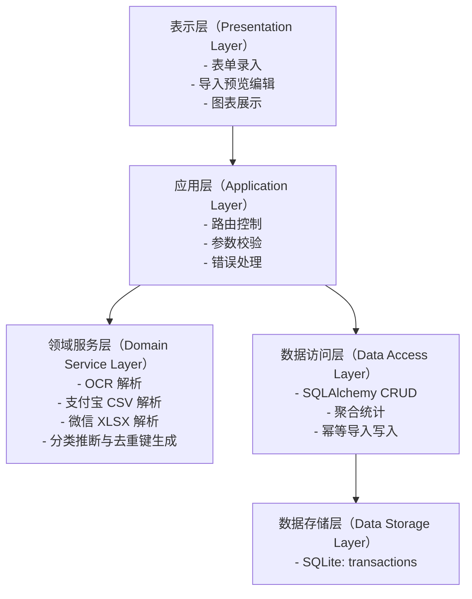

# 家庭财务小管家系统架构图

版本：V1.0  
日期：2026-04-02

本文档给出项目的系统架构图，覆盖以下常用元素：层次、模块、组件、数据存储、服务器、接口箭头、外部系统、边界、网络、注释。

## 一、总体架构图（部署/网络视角）

## 二、逻辑分层架构图（层次/模块视角）

## 三、关键接口箭头（示例）

1. 浏览器 -> 后端：GET /transactions（查询记录）。
2. 浏览器 -> 后端：POST /transactions（新增记录）。
3. 浏览器 -> 后端：POST /transactions/batch（批量入库）。
4. 浏览器 -> 后端：POST /ocr/preview（OCR 预览）。
5. 浏览器 -> 后端：POST /imports/alipay/preview、POST /imports/alipay。
6. 浏览器 -> 后端：POST /imports/wechat/preview、POST /imports/wechat。
7. 浏览器 -> 后端：GET /stats/category/{txn_type}、GET /stats/monthly。

## 四、架构边界与网络说明

1. 网络边界：
   - Client Network：浏览器访问静态页面与 API。
   - Host Network：前后端服务与数据库在同一主机。
2. 可信边界：
   - 外部账单文件（CSV/XLSX）属于非可信输入，必须经过校验与清洗。
3. 数据边界：
   - SQLite 为唯一持久化存储，导入去重依赖 (source, import_key) 唯一约束。

## 五、检查点

1. 是否同时体现部署视角和逻辑分层视角。
2. 是否包含外部系统、服务器、数据库和接口箭头。
3. 是否标注边界与网络关系（端口、协议、传输方式）。
4. 是否体现核心扩展点（OCR、导入解析、统计聚合、幂等去重）。
